# UAS PEMROGRAMAN Web 1
# Nama: Bagus Aditya Hermawan
# Nim: 312410382
# Kelas: TI.24.A.3
# Project Aplikasi Sederhana: List Agenda
# Deskripsi:
Aplikasi List Agenda adalah sebuah aplikasi web sederhana yang digunakan untuk membantu pengguna dalam mengelola daftar agenda atau kegiatan secara terstruktur dan dapat diterapkan pada lingkungan perusahaan. Aplikasi ini dibuat untuk mempermudah pengguna agar tidak lupa terhadap jadwal atau kegiatan penting yang akan dilakukan. Dalam penggunaannya, aplikasi ini menerapkan pembagian hak akses, di mana role admin memiliki spesial akses berupa menambah, mengedit, dan menghapus data agenda, sedangkan role user hanya dapat melihat data agenda serta menggunakan fitur pencarian dan pagination/halaman untuk mempermudah pencarian data. Aplikasi List Agenda juga dilengkapi dengan tampilan yang sederhana dan mudah dipahami sehingga dapat digunakan dengan nyaman. Secara keseluruhan, aplikasi ini dirancang sebagai solusi praktis untuk membantu pengelolaan agenda harian maupun jangka panjang secara lebih tertata dan efisien.

# Langkah-langkah

## Struktur Folder:
###### 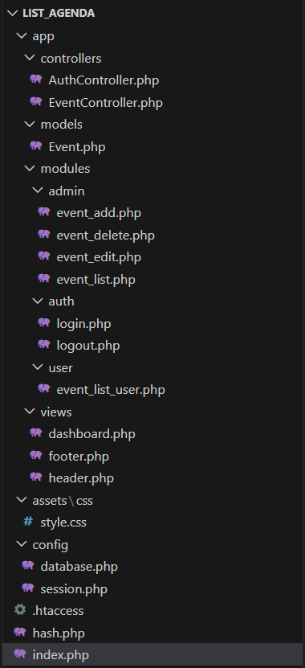.

## Penjelasan Program
Aplikasi List Agenda merupakan aplikasi berbasis web yang digunakan untuk mengelola data agenda atau kegiatan secara terstruktur. Aplikasi ini diawali dengan proses login untuk membatasi hak akses pengguna. Setelah berhasil login, pengguna akan diarahkan ke halaman dashboard sebagai halaman utama aplikasi.
Sistem menerapkan pembagian hak akses berdasarkan peran pengguna, yaitu admin dan user. Admin memiliki kewenangan penuh untuk mengelola data agenda, mulai dari menambahkan, mengubah, hingga menghapus data event. Sementara itu, user hanya dapat melihat daftar event, melakukan pencarian data, serta menggunakan fitur pagination untuk mempermudah penelusuran data. Seluruh data agenda disimpan ke dalam database dan ditampilkan dalam bentuk tabel yang dilengkapi dengan fitur pencarian dan pembagian halaman. Aplikasi ini dirancang dengan tampilan yang sederhana agar mudah digunakan dan membantu pengguna dalam mengelola jadwal kegiatan secara efektif dan efisien.

## Kode Program
1. AuthController.php
###### 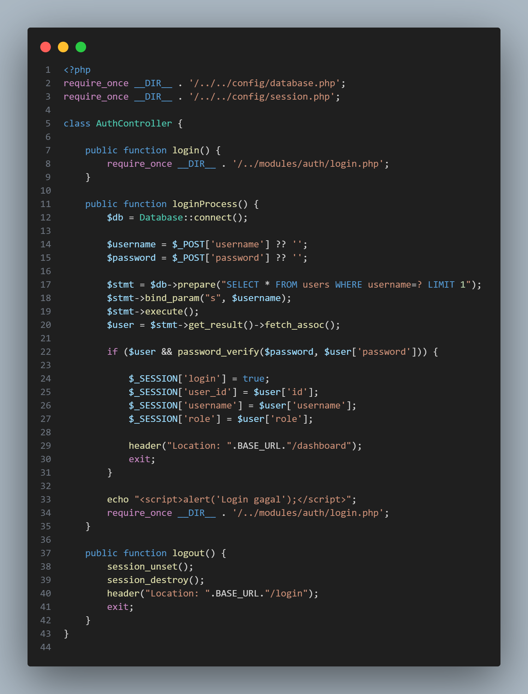.
AuthController berfungsi untuk mengatur proses autentikasi pengguna pada aplikasi List Agenda. program memanggil file konfigurasi database dan session untuk memastikan koneksi database tersedia serta session dapat digunakan selama proses login dan logout. _Method login()_ berfungsi untuk menampilkan halaman login kepada pengguna baik admin maupun user. _method loginProcess()_ berfungsi menangani proses login dengan mengambil data username dan password dari form, kemudian mencocokkannya dengan data yang tersimpan di database menggunakan _prepared statement_ agar lebih aman. Fungsi _password_verify()_ untuk memastikan kecocokan dengan password yang telah di-hash. Jika proses login berhasil, data pengguna seperti status login, ID user, username, dan role disimpan ke dalam session, lalu pengguna diarahkan ke halaman dashboard. _method logout()_ digunakan untuk mengakhiri sesi pengguna dengan menghapus seluruh data session dan mengarahkan pengguna kembali ke halaman login.

2. EventController.php
###### .
EventController berfungsi sebagai pengatur utama dalam pengelolaan data agenda dengan menerapkan pembatasan akses berdasarkan role pengguna agar sistem berjalan dengan aman dan terstruktur.. _Method dashboard()_ digunakan untuk menampilkan halaman dashboard dan memastikan bahwa hanya pengguna yang sudah login yang dapat mengaksesnya, jika belum login maka pengguna akan diarahkan ke halaman login. _Method index()_ berfungsi untuk menampilkan daftar agenda atau event. Method _create()_ dan _store()_ digunakan untuk proses penambahan event baru dan hanya dapat diakses oleh pengguna dengan role admin, menampilkan form tambah event, dan menyimpan data event ke dalam database dan mengarahkan kembali ke halaman daftar event. Method _edit()_ dan _update()_ berfungsi untuk mengubah data event yang sudah ada, di mana admin dapat mengambil data event berdasarkan ID, menampilkan form edit, lalu menyimpan perubahan ke database. Method _delete()_ digunakan untuk menghapus data event berdasarkan ID dan juga dibatasi hanya untuk admin.

3. Event.php
###### 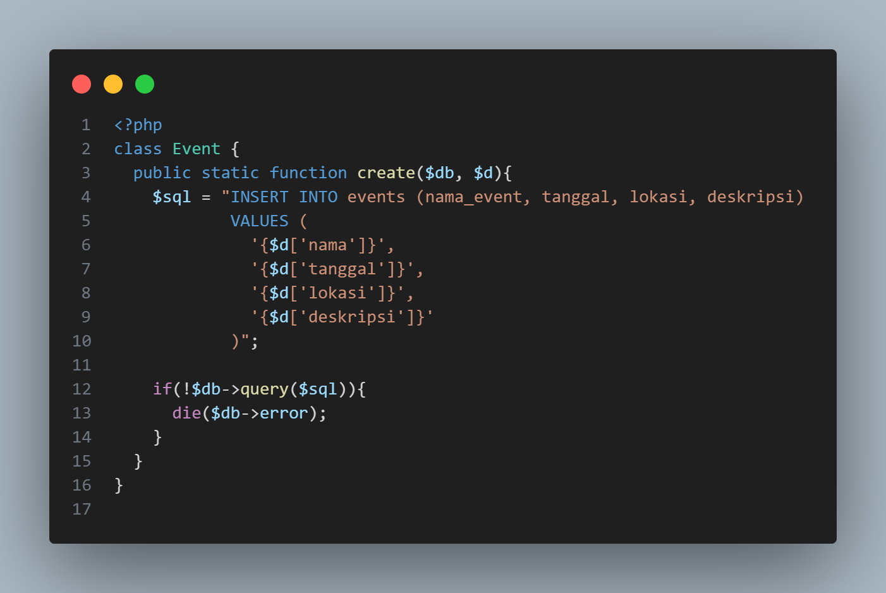.
Kode program event.php berfungsi untuk mengelola proses penyimpanan data agenda ke dalam database pada aplikasi List Agenda. Class ini memiliki method create() yang bersifat statis dan digunakan untuk menambahkan data event baru. Data seperti nama event, tanggal, lokasi, dan deskripsi kemudian dimasukkan ke dalam tabel events melalui perintah dari SQL INSERT. Jika proses penyimpanan data gagal, sistem akan menampilkan pesan error dari database untuk membantu proses pengecekan kesalahan.

4. event_add.php
###### 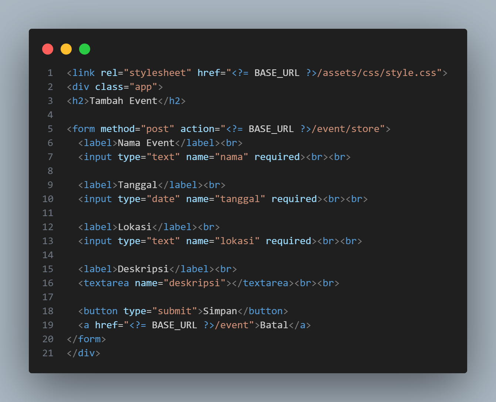.
Pada kode ini berisikan form tambah event dimana didalam form tersebut program meminta admin untuk mengisi input nama event,tanggal,lokasi,dan deskripsi. lalu disimpan ke dalam database.

5. event_delete.php
###### 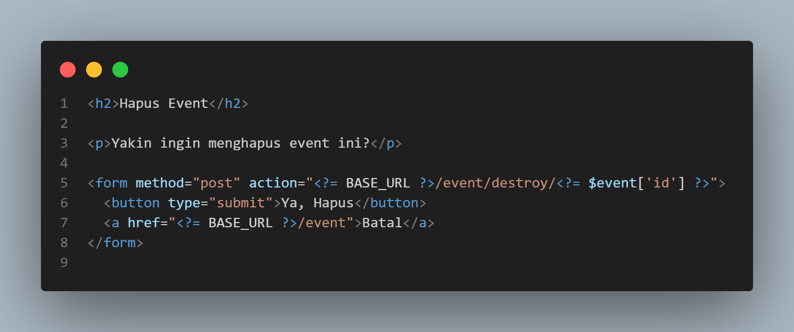.
Event delete berfungsi untuk menghapus list yang sudah dibuat. untuk meyakinkan admin program akan mengirimkan notifikasi untuk meyakini apakah lanjut dihapus atau tidak. dilengkapi tombol batal ketika tidak jadi untuk menghapus event.

6. event_edit.php
##### 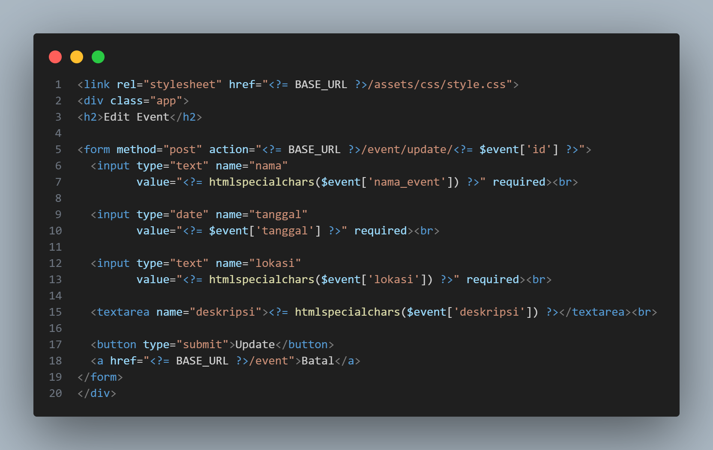.
Pada edit event program menyediakan form untuk update event yang telah dibuat sebelumnya. program meminta admin untuk menginput nama evet,tanggal,lokasi, dan deskripsi. setelah itu, admin menggunakan tombol update apabila lanjut dan tombol batal apabila tidak lanjut.

7. event_list.php
##### 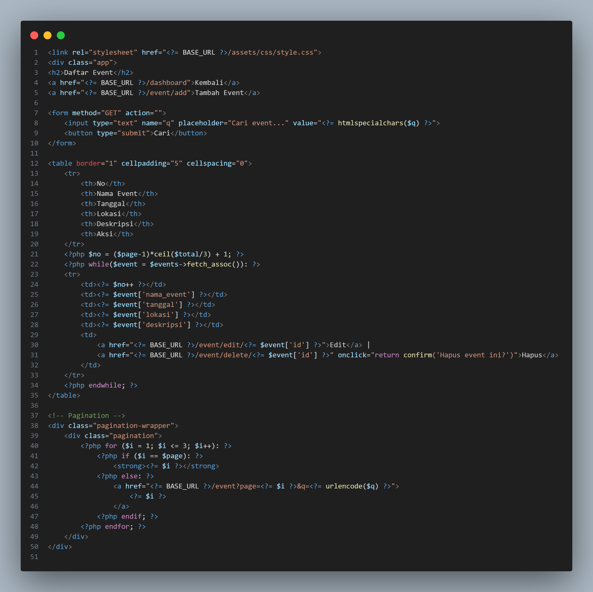.
Kode tersebut menampilkan halaman daftar event pada aplikasi List Agenda yang digunakan oleh admin untuk melihat dan mengelola data agenda. dilengkapi tombol navigasi untuk kembali ke dashboard dan menambahkan event baru. halaman ini menampilkan daftar event dalam bentuk tabel serta menyediakan fitur pencarian berdasarkan nama event dan pagination agar data mudah ditelusuri. admin juga diberikan aksi tambah, edit, dan hapus event, di mana penghapusan data dilengkapi dengan konfirmasi. admin dapat menggunakan pagination ke halaman selanjutnya apabila list sudah mencapai batas maksimal perhalaman.

8. login.php
##### 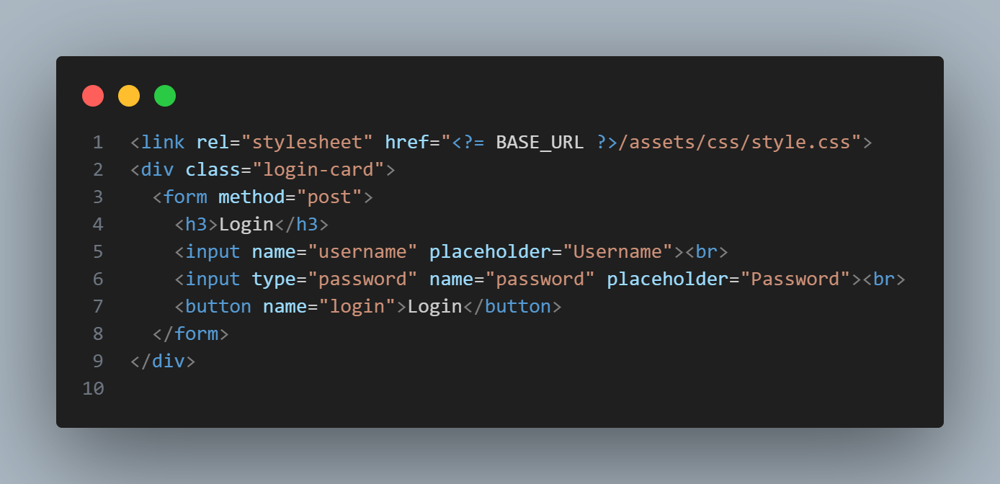.
Kode program ini menampilkan halaman form login yang digunakan pengguna untuk memasukkan username dan password sebelum mengakses sistem. menggunakan metode POST untuk mengirimkan data ke proses autentikasi.

9. logout.php
##### 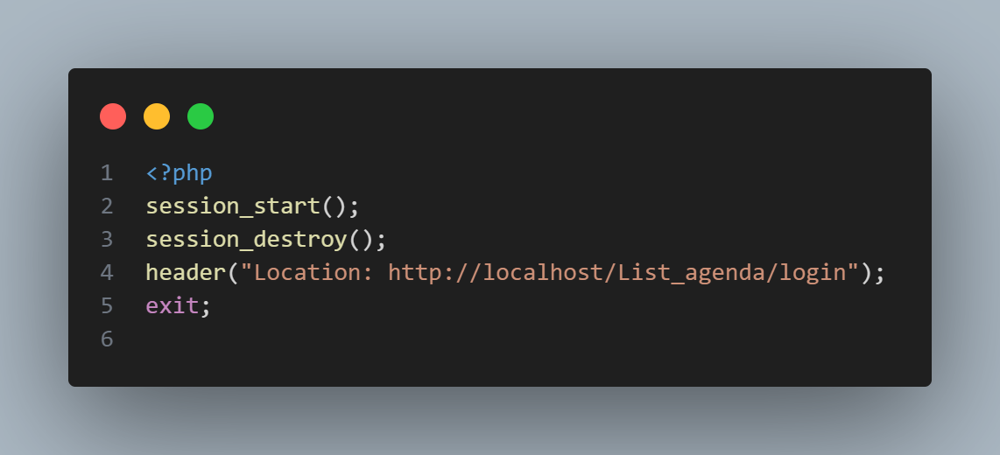.
Kode berfungsi untuk menghubungkan antara halaman dashboard dan login ketika pengguna logout dari aplikasi. _session_start()_ untuk mengakses session yang sedang aktif, kemudian _session_destroy()_ digunakan untuk menghapus seluruh data session sehingga status login pengguna diakhiri.

10. event_list_user.php
##### 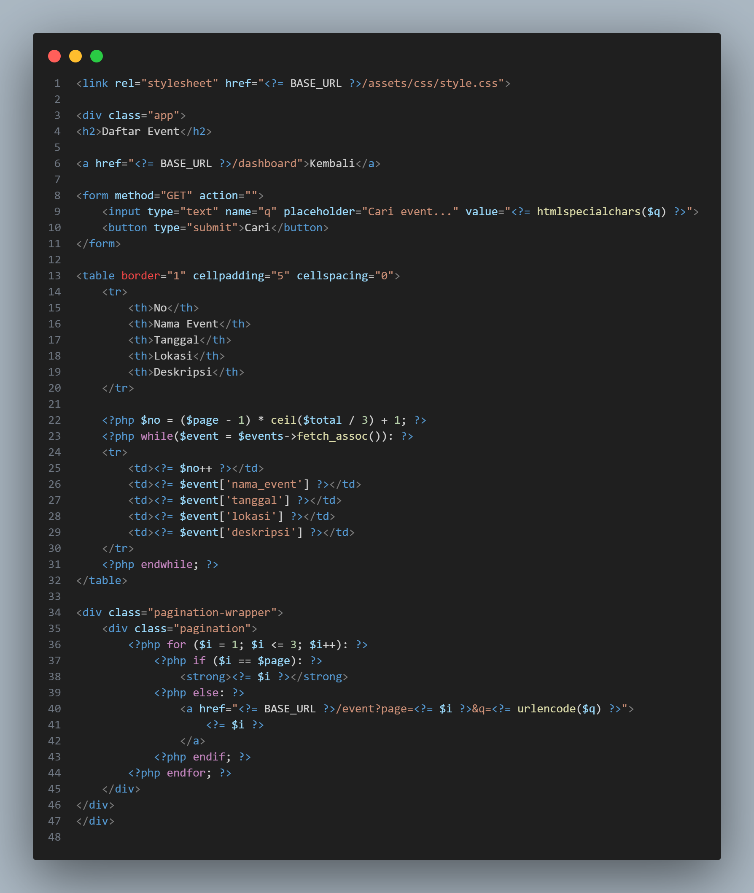.
Hampir sama seperti bagian admin. kode ini hanya menampilkan halaman daftar event pada aplikasi List Agenda yang digunakan oleh admin untuk melihat dan mengelola data agenda. dilengkapi tombol navigasi untuk kembali ke dashboard. halaman ini menampilkan daftar event dalam bentuk tabel serta menyediakan fitur pencarian dan pagination.

11. dashboard.php
##### 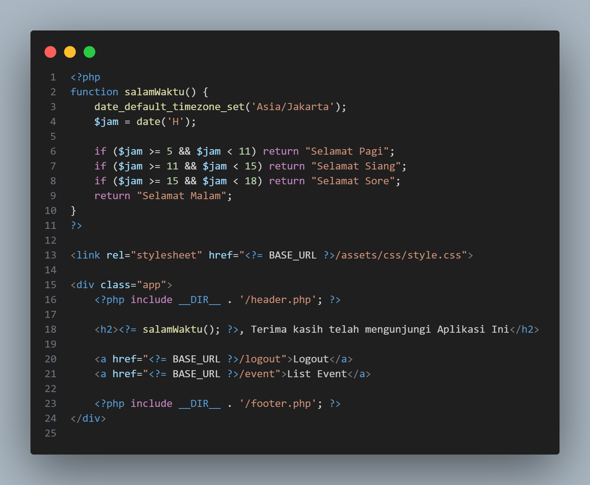.
Kode berfungsi untuk menampilkan halaman dashboard yang dilengkapi dengan fitur ucapan otomatis berdasarkan waktu. fungsi salamWaktu() yang digunakan untuk menentukan ucapan selamat pagi, siang, sore, atau malam sesuai dengan waktu saat ini berdasarkan zona waktu Asia/Jakarta. _<?php include __DIR__ . '/header.php'; ?>_ dan _<?php include __DIR__ . '/footer.php'; ?>_ berfungsi untuk menghubungkan dengan file header.php dan footer.php.

12. footer.php
##### 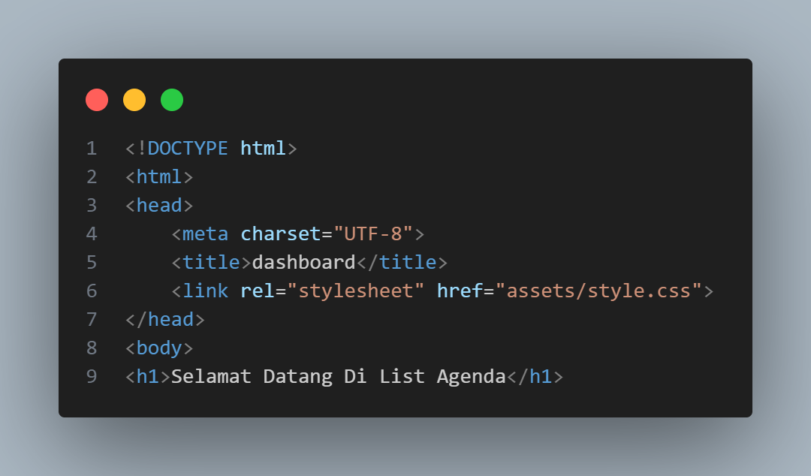.
Berfungsi untuk membuat judul aplikasi ini.

13. hedaer.php
##### 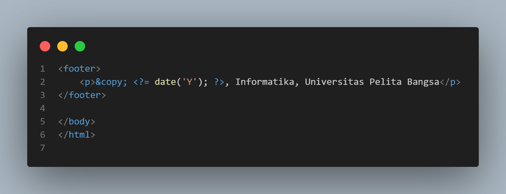.
Sebagai penutup halaman web. _date('Y')_ berfungsi menampilkan informasi hak cipta.

14. style.css
##### .
Kode ini berfungsi agar tampilan aplikasi ini lebih menarik dan nyaman ketika digunakan.

15. database.php
##### 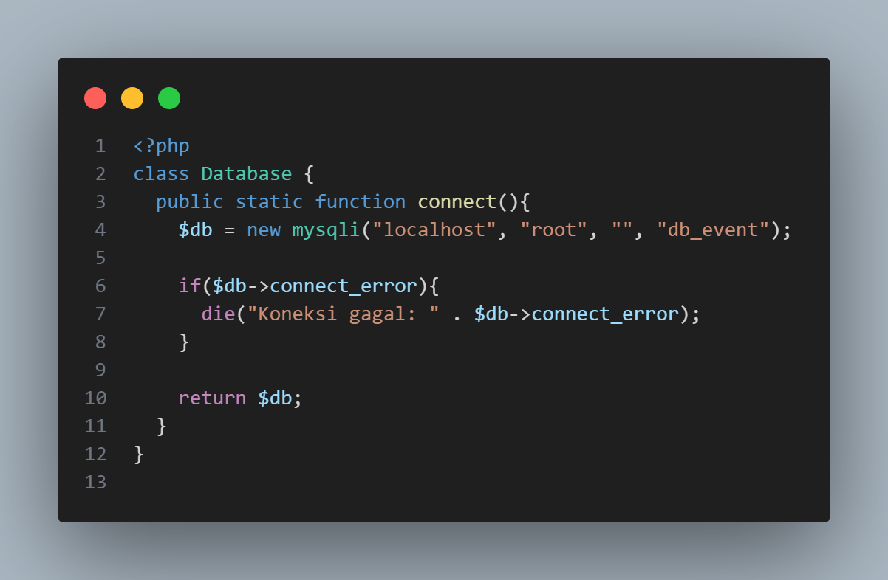.
Class Database yang menghubungkan aplikasi ini ke database MySQL. Method _connect()_ bersifat statis sehingga dapat dipanggil langsung tanpa membuat objek, di dalamnya dibuat koneksi ke database db_event menggunakan mysqli dengan host localhost.

16. session.php
##### 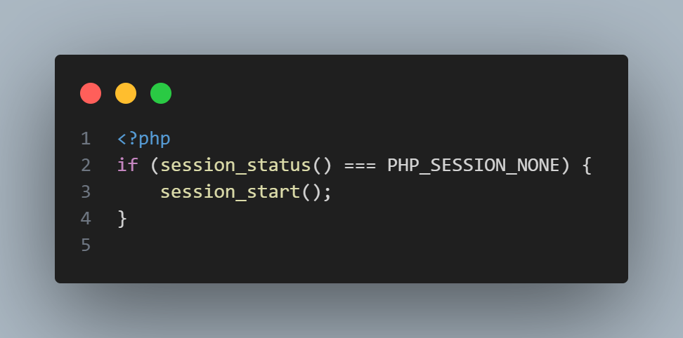.
Kode berfungsi untuk memastikan bahwa session PHP hanya dijalankan satu kali. _session_status() === PHP_SESSION_NONE_ digunakan untuk mengecek apakah sesi belum aktif. Jika belum ada sesi yang berjalan, maka fungsi _session_start()_ akan dipanggil untuk memulai session.

17. .htaccess
##### 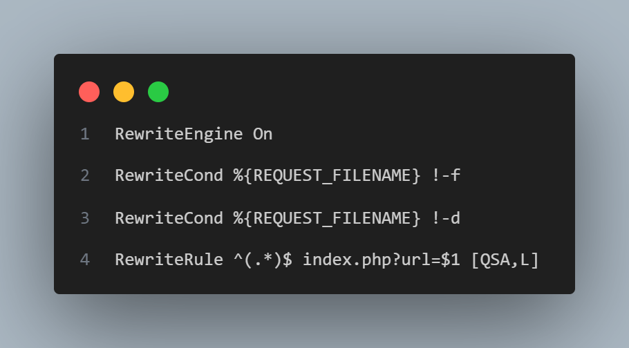.
Yntuk mengatur URL routing, agar URL terlihat lebih rapi dan tidak menampilkan nama file PHP secara langsung.

18. hash.php
##### 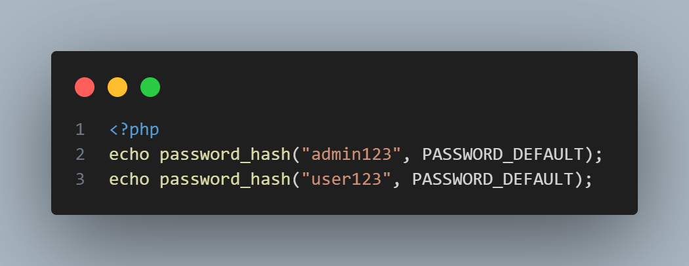.
Berfugnsi untuk membuat password user dan admin agar lebih aman.

19. index.php
##### 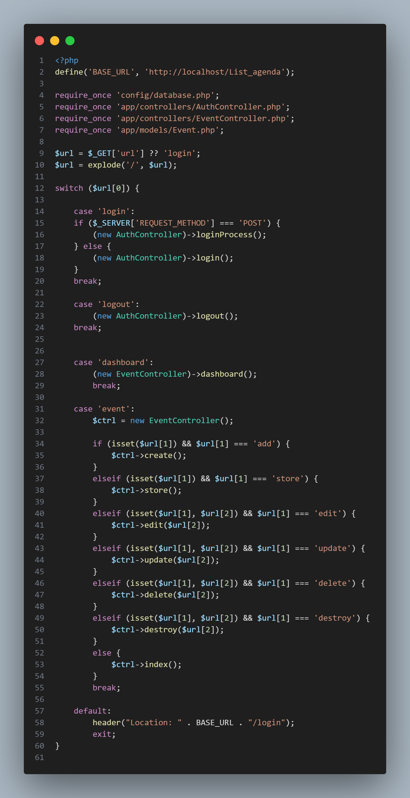.
Kode ini berfungsi sebagai pengatur utama alur aplikasi (router) yang menentukan halaman atau proses apa yang dijalankan berdasarkan URL yang diakses pengguna. File ini memanggil konfigurasi dan controller yang dibutuhkan, lalu mengarahkan pengguna ke halaman login, dashboard, dan fitur event seperti tambah, edit, dan hapus data. Jika URL tidak sesuai, pengguna akan otomatis diarahkan ke halaman login.

## Database
##### .
Membuat database dengan nama db_event.
##### 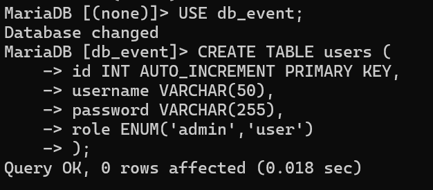.
##### 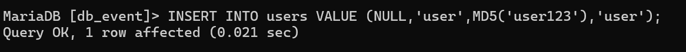.
##### 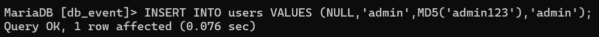.
##### 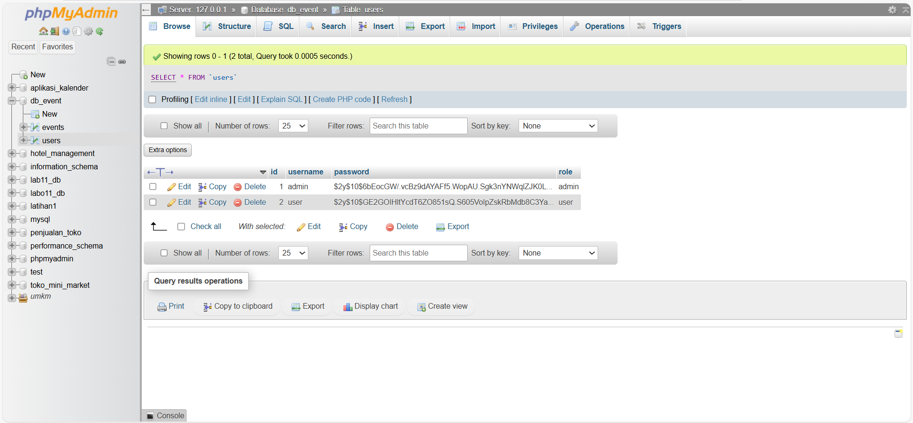.
Membuat tabel user berisikan id,username,dan password.
##### 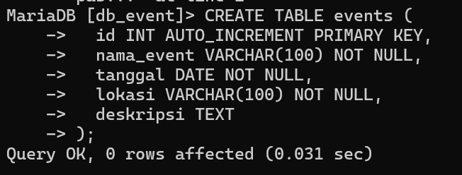.
##### 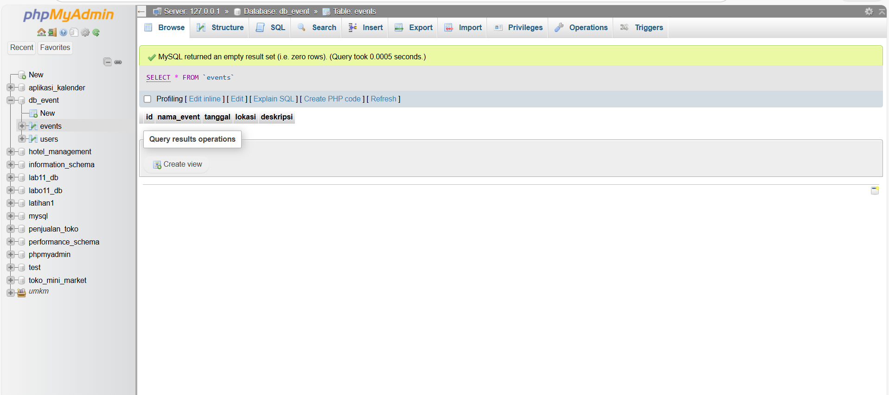.
Membuat tabel events berisikan id,nama evetnt,tanggal,lokasi,dan deskripsi.

## Alur Program Dan Fungsional Sistem
## 1. Login
##### 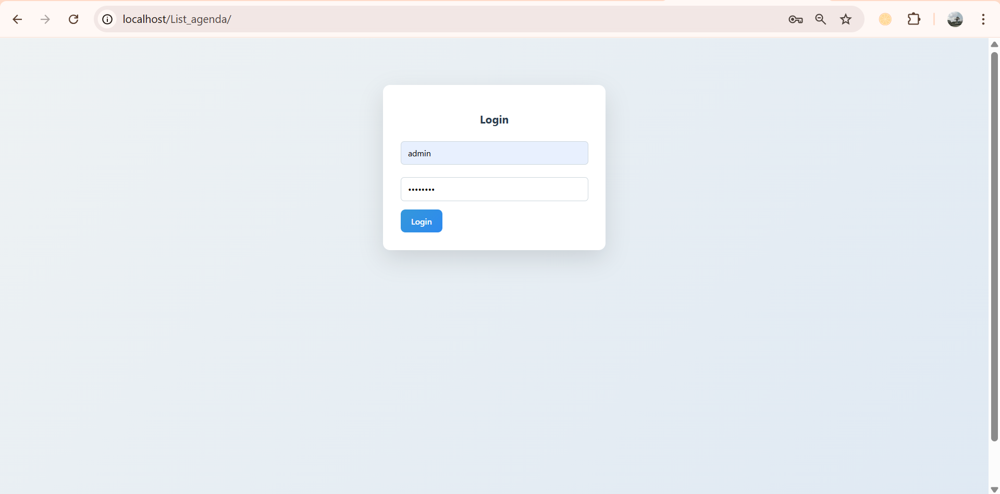.
##### 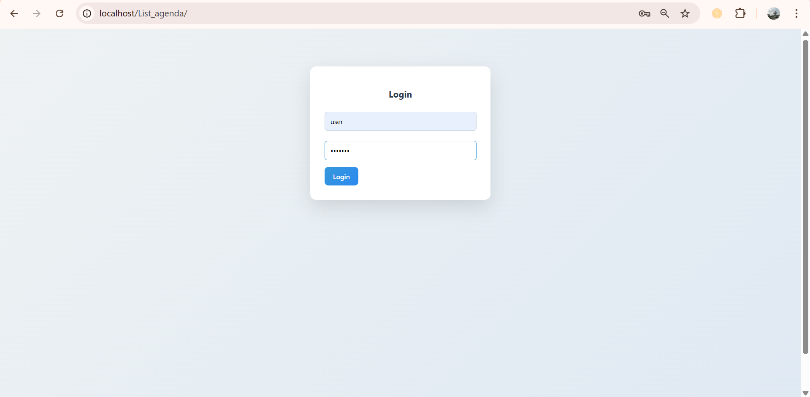.
Admin dan user terlebih dahulu login dengan username:admin dan password:admin123, username:user dan password:user123. Sistem akan memverifikasi data yang dimasukkan dan menentukan hak akses pengguna berdasarkan rolenya yakni admini dan user. kemudian tekan tombol login.

## 2. Dashboard
##### 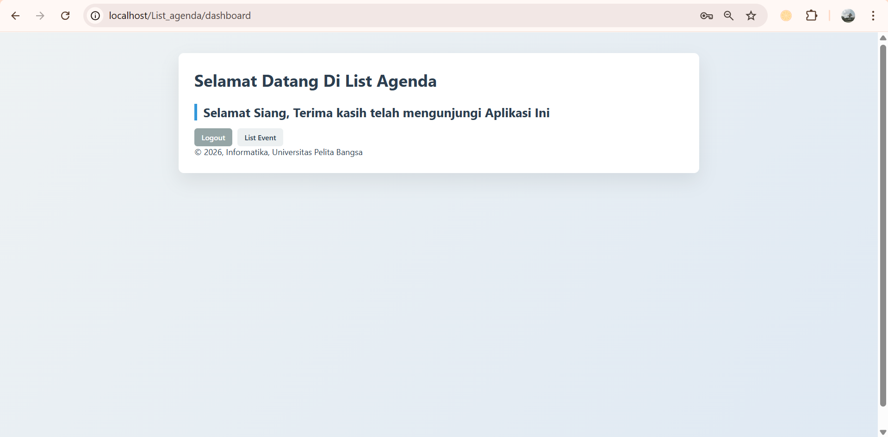.
Setelah login admin dan user akan diarahkan oleh sistem ke halaman dashboard. dashboard ini memudahkan pengguna untuk mengakses ke halaman dan fitur lainnya. terdapat ucapan selamat datang dan salam waktu kepada pengguna. terdapat fitur list event dan logout(jika admin dan user ingin keluar dari aplikasi). lalu menekan tombol list event.

## 3. List/Daftar Event
Menampilkan seluruh data agenda yang tersimpan di dalam sistem yang berbentuk tabel. Informasi yang ditampilkan meliputi nama event, tanggal, lokasi, dan deskripsi. Halaman ini dapat diakses oleh admin maupun user, namun hak akses yang diberikan berbeda sesuai dengan role pengguna.
Role admin:
##### 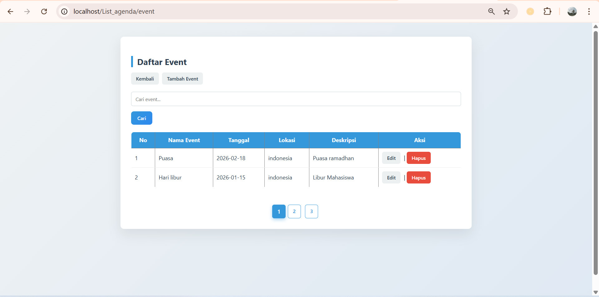.
Di halaman ini admin dapat mmenggunakan fitur CRUD, kolom pencarian, pagination, dan tombol kembali untuk kembali ke dashboard.
##### 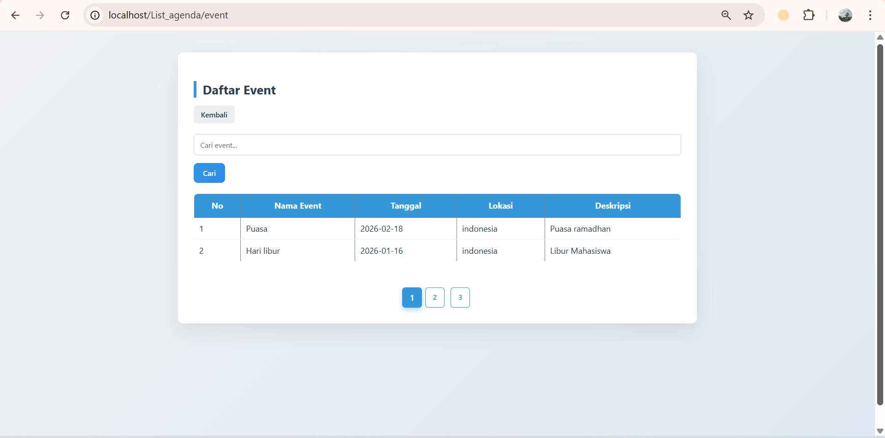.
User pada daftar event ini hanya dapat melihat tabel list event. user juga bisa menggunakan fitur kolom pencarian, pagination, dan tombol kembali.

## 4. Tambah Event
##### 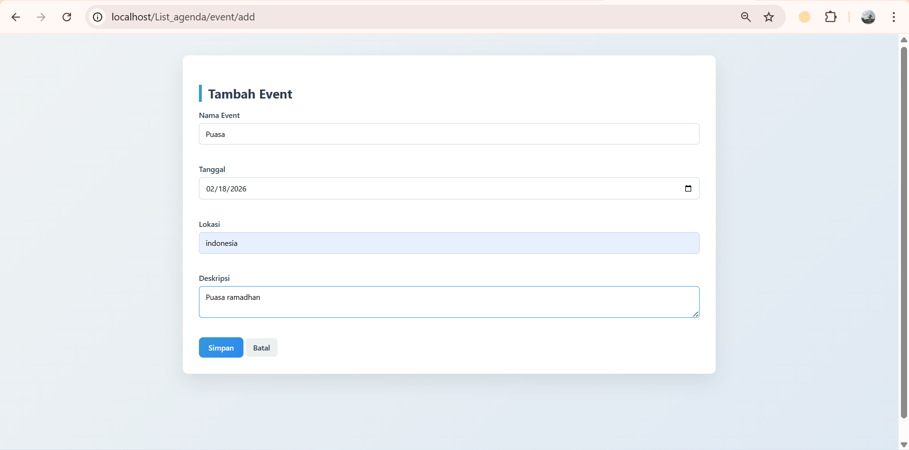.
Fitur tambah event hanya dapat digunakan oleh role admin. Pada fitur ini admin dapat menambahkan data agenda baru dengan mengisi form yang berisi nama event, tanggal, lokasi, dan deskripsi. Setelah data disimpan, event baru akan ditampilkan pada halaman daftar event. terdapat juga tombol batal apabila tidak jadi untuk menambahkan event tersebut.

## 5. Edit Event
##### 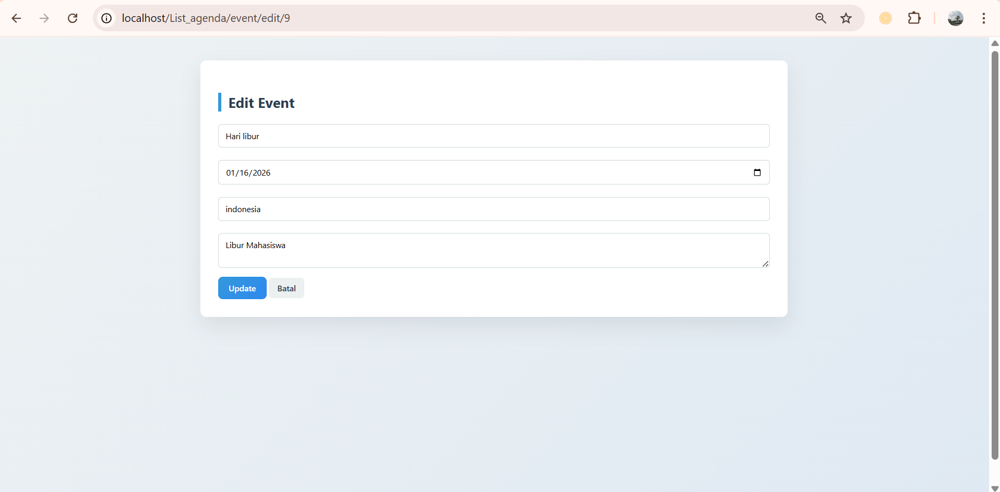.
Halaman edit event digunakan role admin untuk mengubah data event yang sudah ada. Form edit akan menampilkan data lama yang dapat diperbarui sesuai kebutuhan pengguna. Setelah proses penyimpanan, perubahan data akan langsung diterapkan dan ditampilkan pada daftar event. tombol batal untuk tidak jadi update agenda.

## 6. Hapus Event
##### 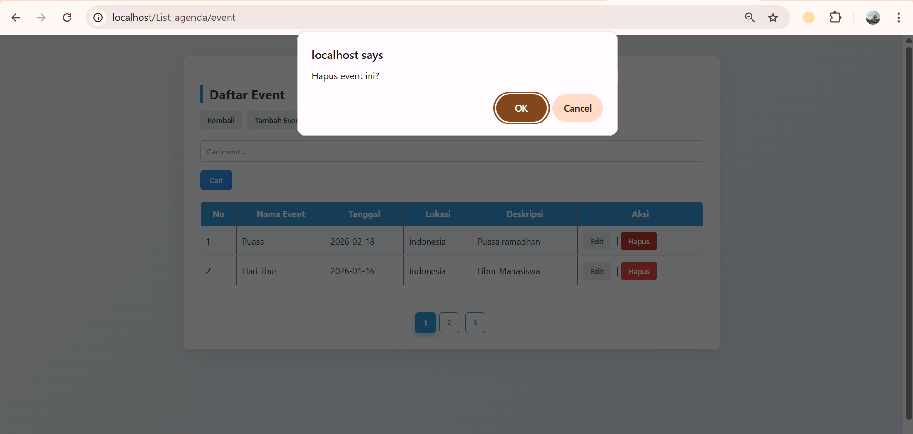.
Fitur hapus event memungkinkan admin untuk menghapus data agenda yang tidak lagi dibutuhkan. Sebelum data dihapus, sistem akan menampilkan konfirmasi untuk memastikan aksi tersebut. Setelah dihapus, data event akan hilang dari sistem dan database. bisa menggunakan tombol cancel apabila hapus tidak jadi.

## 7. Kolom Pencarian
Fitur ini digunakan untuk membantu pengguna menemukan data event tertentu dengan lebih cepat. Pengguna dapat memasukkan kata kunci pada kolom pencarian, kemudian sistem akan menampilkan data event yang sesuai dengan kata kunci tersebut. Fitur ini tersedia untuk admin dan user.
Admin:
##### 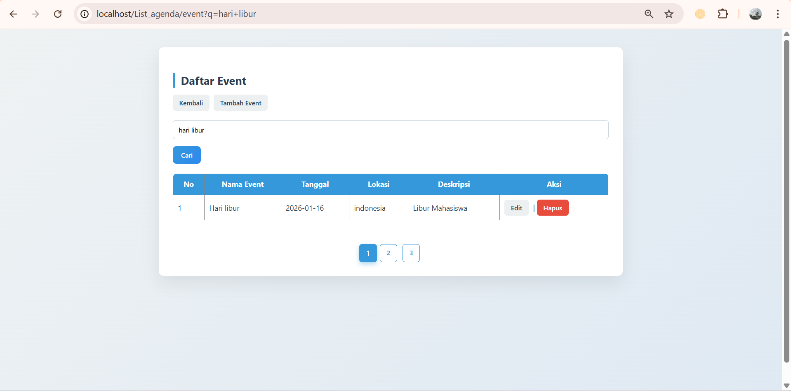.
User:
##### 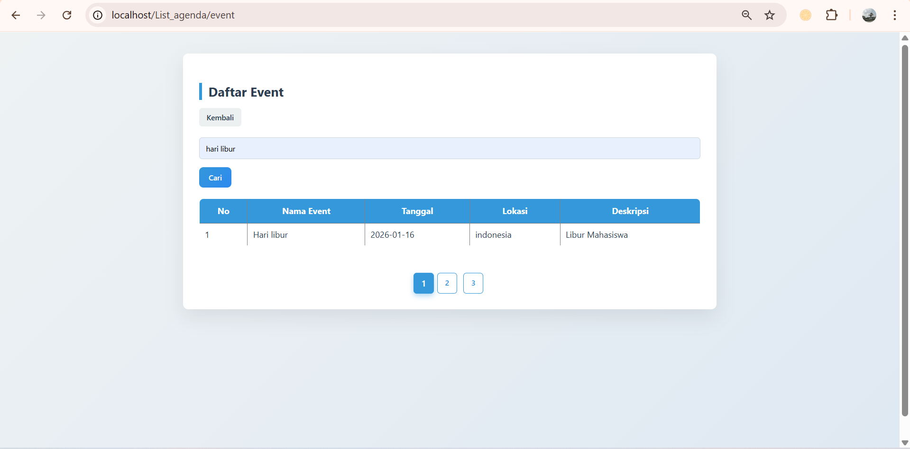.

## 8. Pagination
Fitur ini untuk membagi data event ke dalam beberapa halaman agar tampilan data lebih rapi dan mudah dibaca. Dari adanya pagination, pengguna dapat berpindah antar halaman untuk melihat data event lainnya tanpa harus menampilkan seluruh data dalam satu halaman.
Admin:
##### .
User:
##### .

## 9. Logout
Fitur logout digunakan untuk mengakhiri sesi ketika user dan admin sudah ingin keluar dari aplikasi. Setelah logout, sistem akan menghapus sesi pengguna dan mengarahkan kembali ke halaman login. Fitur ini bertujuan untuk menjaga keamanan aplikasi, terutama jika aplikasi digunakan pada perangkat bersama.
##### .
